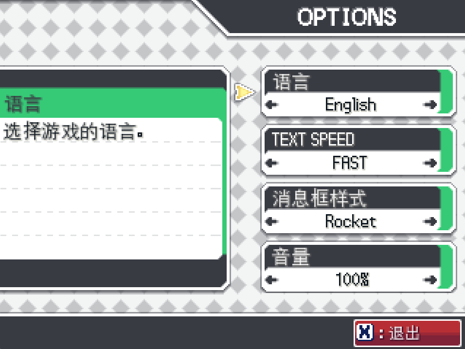
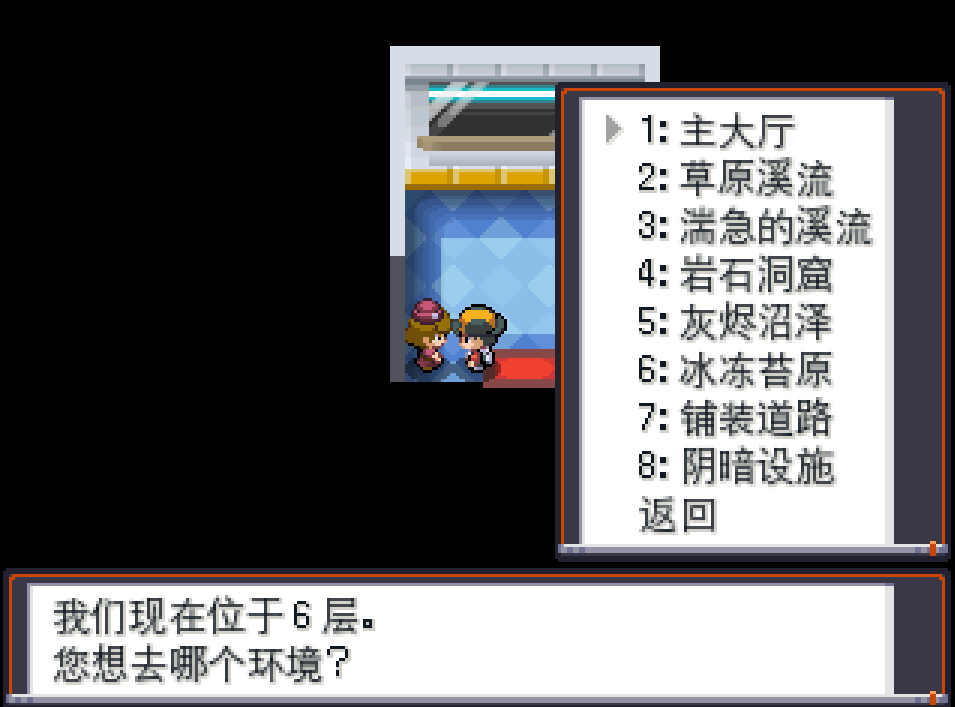

# Pokemon Studio 中文字体

**构建方法**：将 Pokemon Studio 的默认字体与中文等线字体进行合并，以支持中文字符显示。

## 效果预览
| 原版字体 | 中文字体效果 |
|----------|-------------|
|  |  |

## 如何使用
1. **下载字体**：[点击此处下载最新版本](https://github.com/你的用户名/你的仓库/releases)
2. **安装字体**：
   - Windows：右键 `.ttf` / `.otf` 文件 → “安装”
   - macOS：双击字体文件 → “安装字体”
3. **应用到 Pokemon Studio**：
   - 在游戏/软件设置中选择`Pokemon-Chinese` 字体。
   > **注意**：部分特殊字符可能显示异常。

## 已知问题（Bug）
- 部分标点符号偏移
- 少量生僻字可能无法识别
- 英文与中文间距需要优化

## 贡献 & 反馈
欢迎提交 Issue 或 Pull Request 修复问题！

**2025/06/17**
---
